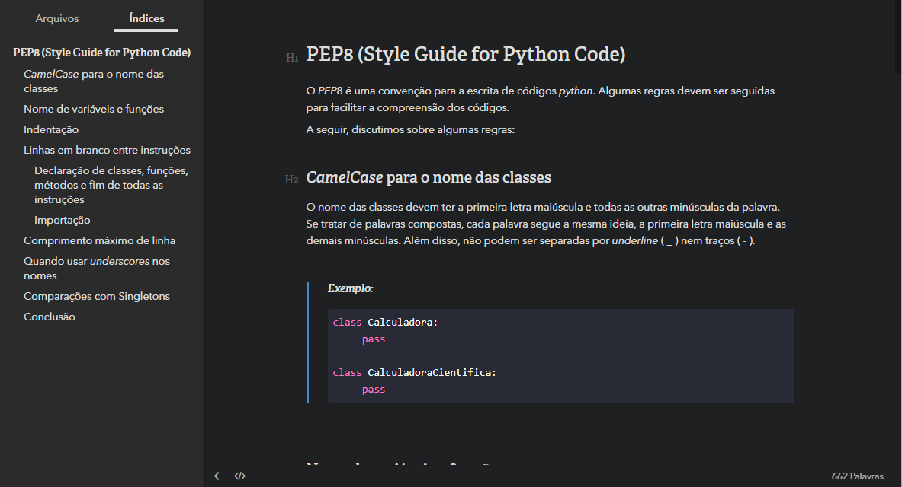

# Resumos sobre Python

Resumos particulares de estudo da linguagem Python em sua atual versão 3.7.4. 

# Aprendendo Python

## Indices

1. [PEP8 - Style Guide for Python Code](Resumos/PEP8/index.html)
2. 

# Sobre mim

Me chamo Ellison William, baiano, itabunense e estudante de Ciência da Computação pela Universidade Estadual de Santa Cruz (**UESC**).

Inicio novamente o estudo dessa linguagem para uso universitário e profissional. O foco é partir para a programação web após concluir o estudo intermediário~avançado da linguagem, mais precisamente, framework [Django](https://www.djangoproject.com/).

# Por que os resumos?

Costumo fazer esses resumos até mesmo sem publicar/compartilhar. Então eu faço outra pergunta: **Por que não compartilhar?**

# Ajude você também!

Aceito qualquer tipo de sugestão e de alteração. 

Para fazer os resumos uso o editor de *[MarkDown](https://pt.wikipedia.org/wiki/Markdown)* chamado [Typora](https://typora.io/). Seus recursos são incríveis junto com sua facilidade de escrita, além de ter um visual minimalista, diversos temas tornando divertido a escrita. Além disso, sendo possível converter para HTML e PDF facilmente.

> 

# Redes sociais

Facebook: https://www.facebook.com/ellison.guimaraes

Instagram: https://www.instagram.com/ellisonwilliam/

Email: ellison.guimaraes@gmail.com

